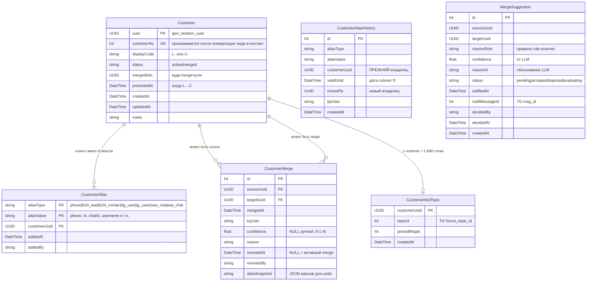
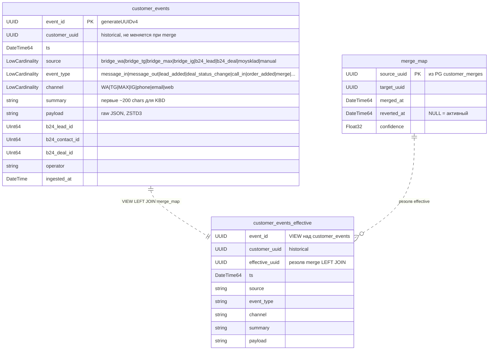
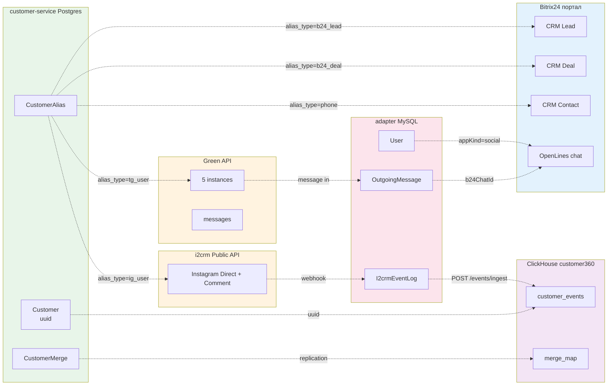

# Data Model — ERD платформы «Первого Бегового»

Полная картина данных Social Connector ecosystem'а. Три БД, ~21 таблица,
3 движка (MySQL/Postgres/ClickHouse). Цель документа — onboarding
backup-person, threat model #50, OpenAPI #52, и просто чтобы при чтении
кода не теряться «откуда это поле».

Last updated: 2026-05-26 (task #47).

## 🎯 Карта систем

```
┌────────────────────────────────────────────────────────────────┐
│  greenapi-b24 (adapter, NestJS)                                │
│  Docker compose на my-server, source-adapter-1                 │
│                                                                │
│  └─→ MySQL adapter (source-db-1)                               │
│      13 таблиц: User, Instance, OutgoingMessage, OAuthApp,     │
│      I2crmEventLog, TgBotEventLog, IgInboundB24Link,           │
│      IgDirectInboundB24Link, IgCommentContext, MaxContact,     │
│      EntityPhonePref, B24EntitySnapshot, OffHoursReply         │
└────────────────────────────────────────────────────────────────┘
                          ↑↓ HTTP (CUSTOMER_SERVICE_URL)
┌────────────────────────────────────────────────────────────────┐
│  customer-service (NestJS+Prisma)                              │
│  /home/dv/customer-service/, port 127.0.0.1:3002               │
│                                                                │
│  └─→ Postgres 16 (customer_service)                            │
│      6 таблиц: customers, customer_aliases,                    │
│      customer_alias_history, customer_kbd_topics,              │
│      customer_merges, merge_suggestions                        │
└────────────────────────────────────────────────────────────────┘
                          ↓ HTTP /events/ingest
┌────────────────────────────────────────────────────────────────┐
│  ClickHouse (my-server) — БД customer360                       │
│  127.0.0.1:8123, customer360_writer / customer360_reader       │
│                                                                │
│  └─→ 2 таблицы + 1 view:                                       │
│      customer_events (append-only log),                        │
│      merge_map (copy из PG для JOIN),                          │
│      customer_events_effective (VIEW для merge resolve)        │
└────────────────────────────────────────────────────────────────┘
```

**Master record** клиента — `customer_service.customers.uuid`. Все
события в CH ссылаются на UUID, не на B24 id или phone. Aliases
(phone, b24_lead, tg_user, ig_user, etc.) — отдельная таблица для
кросс-канальной связки.

---

## 🗄 1. adapter — MySQL (Prisma)

Хранит OAuth-токены B24, маппинги Green API instances, журналы
i2crm/TG-bot incoming, IG-link таблицы для reply-quoting.

```mermaid
erDiagram
    User {
        string id PK
        text accessToken
        text refreshToken
        DateTime tokenExpiresAt
        string portalDomain UK
        text applicationToken
        DateTime createdAt
        DateTime updatedAt
    }

    Instance {
        BigInt id PK
        BigInt idInstance UK "Green API instance id"
        string apiTokenInstance
        InstanceState stateInstance "authorized/yellowCard/blocked/..."
        string userId FK
        Json settings
        UnsignedMediumInt bitrixLine "LINE в B24 OpenLines"
        DateTime createdAt
        DateTime updatedAt
    }

    OAuthApp {
        Int id PK
        string portalDomain
        string appKind "social|customer360"
        string clientId
        text clientSecret
        text accessToken
        text refreshToken
        DateTime tokenExpiresAt
        text applicationToken
        string scope
    }

    OutgoingMessage {
        string idMessage PK "Green API idMessage"
        string b24ChatId
        string b24MessageId
        string externalChatId
        Int line
        string connector
        string lastStatusSeen "sent<delivered<read"
        DateTime createdAt
        DateTime expiresAt "TTL 24h"
    }

    I2crmEventLog {
        BigInt id PK
        string messageId UK
        string clientId
        string channel "instdir|instcom"
        boolean incoming
        text payload "raw JSON"
        string status "pending|sent|failed"
        Int attempts
        text lastError
        DateTime receivedAt
        DateTime sentAt
    }

    TgBotEventLog {
        BigInt id PK
        string updateId UK
        string chatId
        string messageId
        string direction "in|out"
        text payload
        string status
        Int attempts
        text lastError
        DateTime receivedAt
        DateTime sentAt
    }

    IgInboundB24Link {
        BigInt id PK
        string b24ChatId
        string b24MessageId
        string clientId
        string mediaId
        string commentId
        string commentText
        DateTime createdAt
    }

    IgDirectInboundB24Link {
        BigInt id PK
        string b24ChatId
        string b24MessageId
        string clientId
        string externalMessageId
        string messageText
        DateTime createdAt
    }

    IgCommentContext {
        string clientId PK
        string mediaId PK
        string commentId
        DateTime pinnedMediaSent
        DateTime updatedAt
        DateTime createdAt
    }

    MaxContact {
        BigInt id PK
        BigInt idInstance
        string phone
        string chatId
        DateTime createdAt
        DateTime updatedAt
    }

    EntityPhonePref {
        BigInt id PK
        string portalDomain
        string entityType "lead|deal|contact"
        string entityId
        string phone
        DateTime updatedAt
        DateTime createdAt
    }

    B24EntitySnapshot {
        BigInt id PK
        string entityType "lead|contact|deal"
        Int entityId
        Json fields "полный crm.X.get"
        DateTime updatedAt
        DateTime createdAt
    }

    OffHoursReply {
        BigInt id PK
        string chatKey UK "idInstance:chatId or ig:clientId"
        DateTime lastRepliedAt
        DateTime createdAt
    }

    User ||--o{ Instance : "1 портал — N инстансов GA"
    User ||--o{ OAuthApp : "appKind social vs customer360"
```



### Что где живёт

| Таблица | Назначение | Очистка |
|---|---|---|
| `User` | OAuth-токен Social Connector app (appKind=social, 1 запись) | вручную |
| `OAuthApp` | OAuth-токен Customer-360 app (appKind=customer360) | вручную |
| `Instance` | Green API инстансы: 5 шт (WA/MAX/TG-боты) | при добавлении/удалении |
| `OutgoingMessage` | Mapping Green API idMessage → B24 chat/message для проброса delivery статусов | cleanup expired раз в час, TTL 24ч |
| `I2crmEventLog` | Журнал incoming от i2crm (Instagram), для replay при OVERLOAD_LIMIT | cron 30 дней (если sent=success) |
| `TgBotEventLog` | Журнал incoming/outgoing TG-бота (@begovoy_bot), replay-able | аналогично i2crm |
| `IgInboundB24Link` | Связь B24 message_id ↔ IG comment_id (для reply на конкретный коммент) | без очистки |
| `IgDirectInboundB24Link` | Связь для IG Direct (для reply через quote) | без очистки |
| `IgCommentContext` | Последний context (clientId, mediaId, commentId) для outgoing IG comment | upsert при каждом incoming |
| `MaxContact` | Кеш phone→chatId для MAX (Green API не выдаёт phone напрямую) | без очистки |
| `EntityPhonePref` | Помнит последний выбранный номер в виджете для CRM-entity | upsert при action |
| `B24EntitySnapshot` | Снимок lead/contact/deal для diff-anti-noise events | upsert при ON*UPDATE |
| `OffHoursReply` | Дедуп автоответа «нерабочее время» — один за ночь | без очистки |

---

## 🗄 2. customer-service — Postgres

Master record клиентов с merge-логикой и AI-предложениями.



### Ключевые правила

- **`customers.uuid`** — never changes, single source of truth.
- **`customer_aliases (alias_type, alias_value)` UNIQUE** — обеспечивает
  базовый авто-merge: при попытке добавить занятый alias — сервис
  делает merge.
- **`customer_no`** выдаётся **только** после b24_contact alias
  (т.е. лид сконвертился в контакт в B24). До этого `display_code = "L-<uuid6>"`.
- **`merged_into`** — указывает на target. Effective UUID при чтении —
  через рекурсию `merged_into` (или через CH view `customer_events_effective`).
- **`reverted_at != NULL`** — merge откатили, source снова active.

### Известные alias_type

| alias_type | Источник | Пример value |
|---|---|---|
| `phone` | B24 phone, MoySklad, manual | `+79991234567` |
| `b24_lead` | B24 CRM | `358384` |
| `b24_contact` | B24 CRM | `12345` |
| `b24_deal` | B24 CRM | `67890` (опционально, для merge-engine) |
| `tg_user` | TG-bot updates, wa-tg-bridge | `123456789` (Telegram user.id) |
| `ig_user` | i2crm | `17841405876543` (Instagram client_id) |
| `wa_chat` | Green API | `79991234567@c.us` |
| `max_chat` | Green API MAX | `chatId` (внутренний MAX) |
| `email` | B24 contact, MoySklad | `client@example.com` |

---

## 🗄 3. ClickHouse — БД `customer360`

Append-only event log + merge map. customer_uuid не перезаписывается
при merge (исторический файл), эффективный uuid резолвится через view.



### Принципы

- **Append-only** — никаких UPDATE/DELETE.
- **ENGINE = MergeTree**, `ORDER BY (customer_uuid, ts, event_id)`,
  `PARTITION BY toYYYYMM(ts)`.
- **`merge_map`** — `ReplacingMergeTree(merged_at)`, source of truth
  в Postgres `customer_merges`. CH-копия для JOIN.
- **`customer_events_effective`** — VIEW, при merge events автоматически
  отдаются под target_uuid. Никаких rewrites раньше написанных events.
- **`payload`** — JSON-строка с raw event (не JSON-тип, нестабильный
  в CH 24.8). Парсится через JSONExtract* при запросе.

---

## 🔗 Cross-system relations

Связи между системами — **не FK** (разные движки), а **логические**.



### Точки склейки UUID

| Сценарий | Как находим customer_uuid |
|---|---|
| Incoming WA-сообщение | `phone → CustomerAlias (alias_type=phone, alias_value=+7...)` |
| Incoming TG-bot | `chat_id → CustomerAlias (alias_type=tg_user, alias_value=<id>)` |
| Incoming IG (i2crm) | `client_id → CustomerAlias (alias_type=ig_user, alias_value=<id>)` |
| Incoming MAX | `chatId → MaxContact.phone → CustomerAlias (alias_type=phone)` |
| B24 webhook ON*ADD/UPDATE | `entity_id → CustomerAlias (alias_type=b24_lead/deal/contact, alias_value=<id>)` |
| MoySklad order | `email/phone из counterparty → CustomerAlias` |

**Если alias не находим** → создаётся новый Customer + новый alias.
Затем merge-engine может склеить с существующим клиентом (по rule + AI).

---

## ⚠️ Известные gap'ы (для будущих задач)

1. **Нет cross-DB FK constraints** — RDBMS не может enforce'ить.
   Целостность поддерживается приложением. Sanity-check: периодический
   audit-cron «orphaned events в CH без customer в PG» — **gap, нет такого cron'а**.

2. **`merge_map` в CH ≠ `customer_merges` в PG** — replication через
   приложение (customer-service шлёт INSERT при merge/unmerge).
   **Gap**: если customer-service лёг между merge в PG и INSERT в CH —
   разъедутся. Нужен periodic reconcile.

3. **`adapter` не имеет прямой FK на `customer-service`**. Adapter получает
   uuid через HTTP `/aliases/lookup`. Если customer-service не отвечает →
   event сохраняется в EventLog со status=pending, без uuid. **Gap**: нет
   механизма back-fill uuid для retry-pending events.

4. **`Instance.bitrixLine` UNIQUE per `userId`** — но на одном портале
   может быть несколько `User` (если приложение переустанавливалось).
   Сейчас всегда 1 запись, но schema не предотвращает дубли. **Gap**: возможна
   аномалия после reinstall.

---

## 🎯 Использование этого документа

- **Onboarding backup-person**: единственный документ который нужен чтобы
  понять «где какой клиент»;
- **Threat model #50**: атаки на куда — на customer_aliases, customer_merges;
- **OpenAPI #52**: endpoints customer-service сразу понятны по моделям;
- **Перед миграцией Prisma**: смотреть relations, чтобы не сломать FK;
- **Debugging**: «откуда это поле берётся» → первый поиск здесь.

---

## 📚 Связано

- `prisma/schema.prisma` — adapter (этот репо)
- `~/claude_code/1begovoy/pervyi-begovoy/services/customer-service/prisma/schema.prisma`
- `~/claude_code/1begovoy/pervyi-begovoy/services/customer-service/clickhouse/001_customer_events.sql`
- `CUSTOMER360.md` — flow событий
- `ARCHITECTURE.md §7.5` — формат заголовков карточек клиентов
- `GLOSSARY.md` — точное значение терминов «customer» / «лид» / «alias»
- `decisions/` — ADR с обоснованиями архитектурных решений
