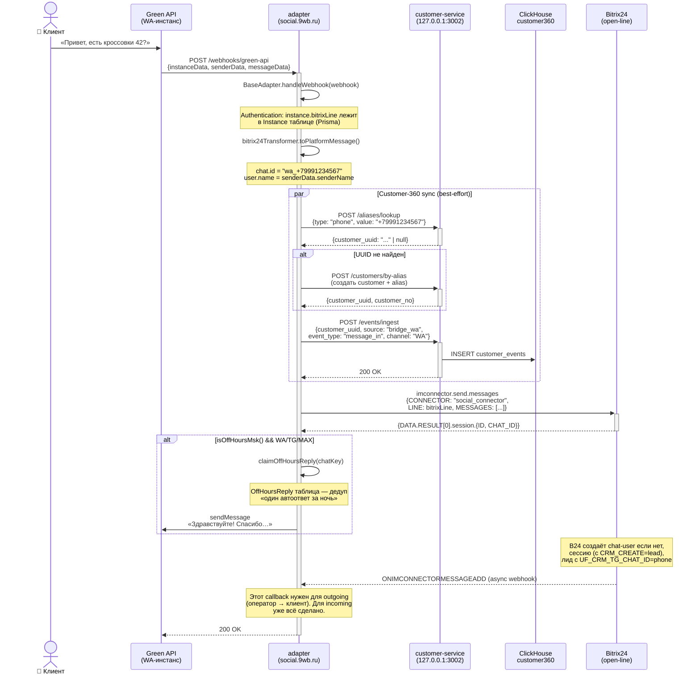
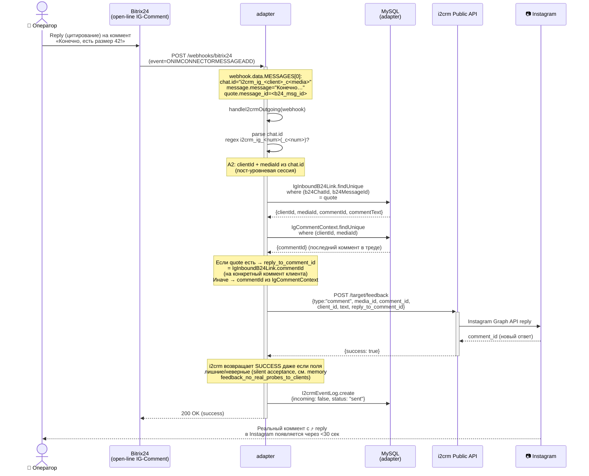
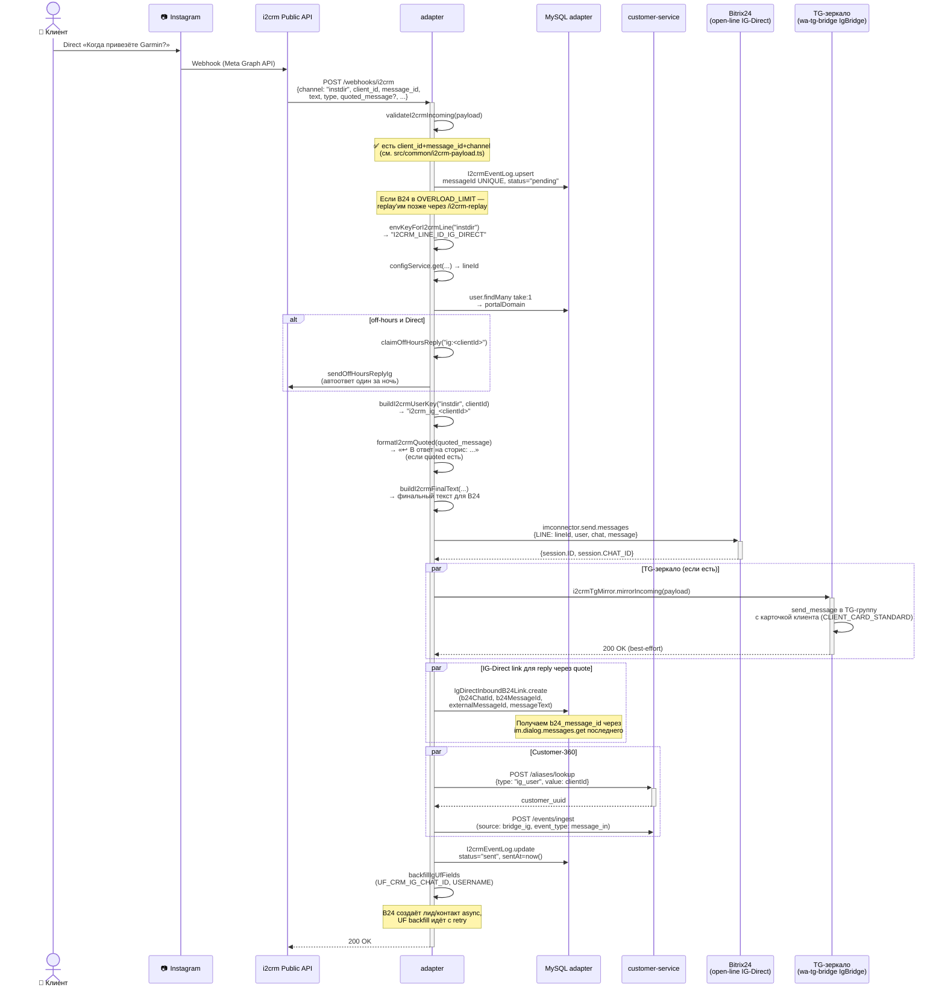
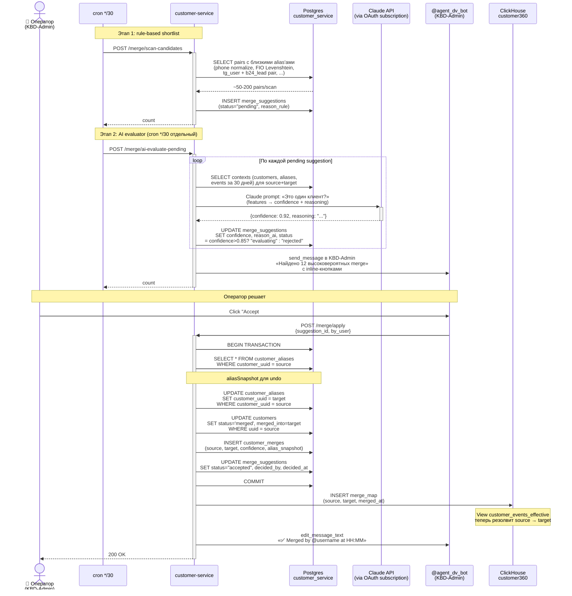
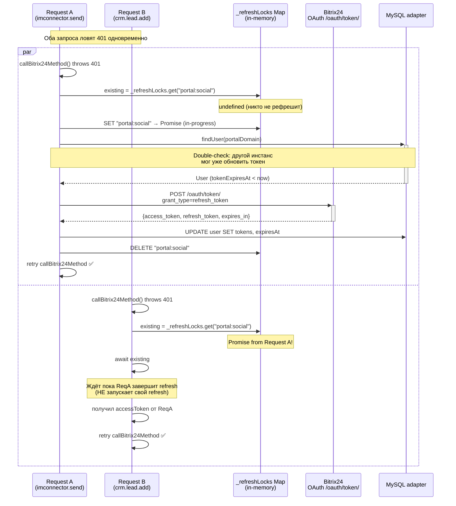

# Sequence Diagrams — критичные flow платформы

Sequence-диаграммы 5 самых критичных flow Social Connector ecosystem'а.
Цель — за 5 минут понять «что происходит когда клиент пишет в WA/IG»
без чтения 6000-строчного `bitrix24.service.ts`.

Last updated: 2026-05-26 (task #48).

См. также: [`DATA_MODEL.md`](./DATA_MODEL.md) для понимания таблиц,
[`OPEN_LINE_LIFECYCLE.md`](./OPEN_LINE_LIFECYCLE.md) для жизненного цикла
сессии, [`INSTAGRAM_FLOW.md`](./INSTAGRAM_FLOW.md) для деталей IG.

---

## 1. Incoming WA-сообщение → B24 + Customer-360

Клиент пишет в WhatsApp на привязанный номер. Сообщение приходит
через Green API webhook, проходит через adapter, попадает в B24
OpenLine как сообщение чата, и параллельно событие летит в
Customer-360 customer_events.

### Грабли в этом flow

- **`outHistory` хранится в-памяти** в Green API — при рестарте теряется.
  Используем `OutgoingMessage` Prisma как persistent mapping.
- **`CRM_CREATE_SECOND=N`** обязательно для линии (#26 ADR), иначе плодятся
  «Повторные лиды» при втором сообщении того же клиента.
- **Customer-360 sync — best-effort** (try/catch). Если customer-service лёг —
  основной B24-flow продолжает работать. Events добиваются после восстановления
  через replay (TODO #58 nextiter).

---

## 2. Outgoing IG-comment из B24 (Reply на конкретный коммент)

Оператор в B24 чате IG-Comment отвечает с цитатой на конкретный коммент
клиента. Adapter должен передать в i2crm `reply_to_comment_id`, чтобы
ответ повис именно под этим комментарием в Instagram (а не общий ответ).

### Грабли в этом flow

- **chat.id regex отстал от incoming формата** — историческая регрессия
  (см. REGRESSIONS.md 25.05). После A2 incoming chat.id может быть
  `i2crm_ig_<c>_c<media>`, outgoing должен парсить тот же формат.
- **`reply_to_comment_id` обязателен** — без него ответ идёт под пост
  как новый коммент, а не reply. Требование i2crm Public API.
- **`IgInboundB24Link`** даёт **точный** comment для reply (по quote),
  но если оператор написал без quote → используется **последний** из
  `IgCommentContext`.
- **i2crm молча принимает неверные поля** — НЕ probe'ить на реальных
  клиентах (см. memory `[[feedback_no_real_probes_to_clients]]`).

---

## 3. Incoming Instagram Direct (через i2crm)

Клиент пишет в Instagram Direct. i2crm подписан на бизнес-аккаунт через
Meta Graph API, отправляет webhook нам, мы доставляем в B24 как сообщение
IG-линии с особой обработкой quoted_message (если ответ на сторис).

### Грабли в этом flow

- **i2crm не шлёт `reply_to_message_id`** для Direct (запрос #32 в support).
  Без этого ответ на конкретное сообщение в треде невозможен.
- **`UF_CRM_IG_USERNAME`** заполняется async (B24 создаёт лид с задержкой
  1-3 сек). Backfill идёт с retry, может занять до 30 сек до появления в UI.
- **`quoted_message`** — может быть string (старый формат) или object
  (новый, для сторис). `formatI2crmQuoted` обрабатывает оба.

---

## 4. Merge UUID (rule-scan + AI evaluator + apply)

Customer-360 сам сканит дубли (rule-based), делает shortlist, ai_evaluator
оценивает через Claude API, оператор в KBD-Admin TG-чате принимает/отклоняет.

### Грабли в этом flow

- **`customer_no`** target не меняется — остаётся исходный (если был).
  Если у source был customer_no, а у target нет → потенциально нужно
  передать (TODO в reason_ai).
- **CH replication через приложение** — если customer-service лёг между
  PG transaction и CH INSERT → разъедутся. Reconcile cron — gap (#).
- **LLM может ошибиться на close call'ах** (двое братьев в семье с разными
  ФИО, общий телефон) — confidence threshold 0.85, ниже = manual review.
- **Undo через `aliasSnapshot`** — JSON массив строк, для восстановления
  оригинальных alias'ов и `reverted_at`.

---

## 5. OAuth refresh token (concurrent-safe mutex)

B24 OAuth токены живут 1 час. При получении 401 от B24 — refresh через
`refreshAccessToken`. Защита от race: два параллельных 401 могут оба
запустить refresh, перезатереть друг друга в БД и пойти retry с разными
токенами.

### Грабли в этом flow

- **`_refreshLocks` — in-memory Map**, не персистится. При рестарте
  adapter'а — clear. Это нормально: после рестарта токен в БД уже
  обновлён (через Prisma).
- **Per-portal-per-appKind ключ** (`"portal:social"`, `"portal:customer360"`):
  Customer-360 app и Social app — разные OAuth, не должны блокировать
  друг друга.
- **Если B24 oauth.bitrix.info лёг** (был факап 2025-03) — Promise
  висит на timeout (axios default 30s), все pending requests блокируются.
  TODO: добавить explicit timeout 10s на refresh + clear на error.
- **`tokenExpiresAt`** проверяется проактивно cron'ом (15 мин), чтобы
  не ждать 401: если осталось < 30 сек — pre-refresh.

---

## 🧭 Когда обновлять эти диаграммы

- **Любое изменение в `handleI2crmIncoming/Outgoing`** → проверь #2 и #3
- **Любое изменение customer-service `/merge/*`** → проверь #4
- **Любое изменение OAuth refresh logic** → проверь #5
- **Новый канал** (например, MAX-comment когда появится) → новый раздел

Все диаграммы — **GitHub Mermaid native** (рендерятся в .md). Не нужны
внешние tools.

## 📚 Связано

- `DATA_MODEL.md` — таблицы которые упомянуты в диаграммах
- `OPEN_LINE_LIFECYCLE.md` — что происходит в B24 при `imconnector.send`
- `INSTAGRAM_FLOW.md` — детали Instagram-flow (A2, поля, edge cases)
- `RUNBOOKS/incident-response.md` — что делать при сбое в любом flow
- `REGRESSIONS.md` — что уже ломалось в этих flow
